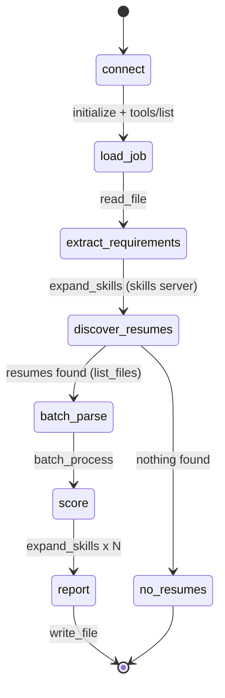

<div align="center">

# 📄 Resume Matching Agent with MCP

**A LangGraph agent that ranks candidates for a job, using file-system tools served over the Model Context Protocol.**


</div>

---

## ✨ Overview

In Milestone 1 the agent owned its file-system tools. In **Milestone 2** those tools move into a
standalone **MCP server**, and the LangGraph agent becomes a pure **MCP client**. Any MCP-capable
client can now reuse the same tools, and the agent can plug in extra servers without code changes.

```
┌────────────────────┐        JSON-RPC 2.0 over stdio        ┌──────────────────────────────┐
│  LangGraph agent   │ ───────────────────────────────────▶  │ filesystem_mcp_server.py     │
│  matching_agent.py │        (MCPRegistry / MCPClient)      │ 10 tools · resources · watch │
│                    │ ───────────────────────────────────▶  ├──────────────────────────────┤
└────────────────────┘                                       │ skills_db_mcp_server.py      │
                                                             │ bonus: skills taxonomy       │
                                                             └──────────────────────────────┘
```

### Highlights

| | |
|---|---|
| 🔌 **Standards-based** | JSON-RPC 2.0 with ids, batches, notifications and standard error codes |
| 🔍 **Resource discovery** | `resources/list`, templates, read, subscribe (`resume:///…`, `config://server`) |
| 👀 **`watch_directory`** | Detects new, modified and deleted resumes; pushes server notifications |
| ⚡ **`batch_process`** | Thread pool, order preserved, one bad file never fails the batch |
| 🧩 **Multi-MCP (bonus)** | Agent discovers tools on every server and routes calls automatically |
| 🔒 **Safe by default** | Sandbox root, extension allow-list, size limits, write allow-list |

---

## 🚀 Quick start

### 1. Set up (macOS / Linux)

```bash
cd resume-mcp-project
python3 -m venv .venv
source .venv/bin/activate
python -m pip install -r requirements.txt
```

> Windows: `.venv\Scripts\activate` instead of `source .venv/bin/activate`.
> Re-run the `source` line in every new terminal.

### 2. Run it

```bash
python matching_agent.py                 # rank the sample resumes
python matching_agent.py --trace         # also print raw JSON-RPC traffic
python matching_agent.py --watch 30      # rank, then watch resumes/ for 30 s
python matching_agent.py --no-skills-server   # single-server mode (compare scores)
python demo.py --pause 2                 # narrated walkthrough (for the demo video)
python -m pytest tests -v                # 27 tests
```

### 3. Expected output

```
Connected MCP servers:
  - filesystem: 10 tools, 6 resources
  - skills: 3 tools, 1 resources
Graph path: connect -> load_job -> extract_requirements -> discover_resumes -> batch_parse -> score -> report

| Rank | Candidate     | Score | Grade    | Years | Missing required                           |
|------|---------------|-------|----------|-------|--------------------------------------------|
| 1    | Alice Johnson | 100.0 | Strong   | 10    | -                                          |
| 2    | Bob Smith     | 63.3  | Moderate | 4     | postgresql                                 |
| 3    | Carol Diaz    | 21.3  | Weak     | 1     | aws, docker, postgresql, rest apis         |
| 4    | Dan Wright    | 0.0   | Weak     | 11    | aws, docker, git, postgresql, python, ...  |
```

The report is also written through MCP to `data/reports/ranking.md`.

---

## 🧠 How it works

### Agent workflow (LangGraph)



Full diagrams: [`docs/workflow_state_machine.png`](docs/workflow_state_machine.png),
[`docs/mcp_sequence.png`](docs/mcp_sequence.png), [`docs/workflow_diagram.md`](docs/workflow_diagram.md).

### Scoring

| Component | Weight | Rule |
|---|---|---|
| Required skills | 60% | fraction of required skills found |
| Preferred skills | 20% | fraction of preferred skills found |
| Experience | 20% | `min(1, years / minimum)` scaled by required-skill coverage, so unrelated years don't count |

Grades: **Strong** ≥ 75 · **Moderate** ≥ 50 · **Weak** < 50. Scoring is deterministic (no LLM).

### Job description format

`data/jobs/job_description.txt` uses simple headers the agent parses:

```
Title: Senior Backend Engineer
Company: Acme Cloud
Required Skills: Python, REST APIs, PostgreSQL, Docker, AWS, Git
Preferred Skills: Kubernetes, Terraform, CI/CD
Minimum Experience: 5 years
```

---

## 🛠 MCP server reference

### Tools (`filesystem_mcp_server.py`)

| Tool | Purpose |
|---|---|
| `list_files` | List resume/job files (recursive, glob pattern) |
| `read_file` | Read txt / md / json / **pdf** / **docx** as text |
| `get_file_info` | Size, type, timestamps, SHA-256 |
| `search_files` | Substring or regex search across files |
| `parse_resume` | Name, emails, phones, sections, years of experience |
| `write_file` | Write `.txt` / `.md` / `.json` (used for the report) |
| `batch_process` | ⭐ Many files at once: `parse`, `extract_text` or `info` |
| `watch_directory` | ⭐ `start` / `poll` / `stop` / `list` a directory watcher |
| `get_config` / `update_config` | Inspect and tweak runtime settings |

### Resources

| URI | Content |
|---|---|
| `resume:///<relative/path>` | Any allowed file, as extracted text |
| `resume:///{path}` | Resource template |
| `config://server` | Effective configuration (JSON) |

### Error handling

| Situation | Response |
|---|---|
| Bad JSON | JSON-RPC error `-32700` |
| Invalid request | `-32600` |
| Unknown method | `-32601` |
| Missing / wrong-typed arguments, unknown tool | `-32602` |
| Resource not found | `-32002` with `data.uri` |
| Tool failure (missing file, path traversal, file too big) | normal result with `isError: true` |

### Configuration

Precedence: **defaults < `config/server_config.json` < env `RESUME_MCP_ROOT` < `--root` flag**.

```json
{
  "root_dir": "./data",
  "allowed_extensions": [".txt", ".md", ".pdf", ".docx", ".json"],
  "max_file_size_mb": 10,
  "batch_workers": 4,
  "max_batch_size": 200,
  "watch_interval_seconds": 2.0
}
```

`update_config` can change only runtime-safe keys. `root_dir` is deliberately not changeable.

### Try the server by hand

```bash
python filesystem_mcp_server.py --root ./data
```

Then paste JSON lines on stdin:

```json
{"jsonrpc":"2.0","id":1,"method":"initialize","params":{"protocolVersion":"2024-11-05"}}
{"jsonrpc":"2.0","method":"notifications/initialized"}
{"jsonrpc":"2.0","id":2,"method":"tools/list"}
{"jsonrpc":"2.0","id":3,"method":"tools/call","params":{"name":"list_files","arguments":{"directory":"resumes"}}}
```

---

## 🧪 Tests

```bash
python -m pytest tests -v
```

| Area | What is verified |
|---|---|
| Protocol (S1–S4) | handshake, all error codes, notifications, batches, id echo, init required |
| Discovery (S5–S7) | tools list, resources, templates, read, not-found, subscribe |
| Tools (S8–S12, S15) | all tools, sandbox traversal blocked, write rules, batch partial failure, DOCX, config precedence |
| Watch (S13–S14) | created / modified / deleted events and live notifications over a real subprocess |
| Agent (A1–A8) | scoring, full ranking, empty-folder branch, corrupt file skipped, incremental and watch mode, multi-MCP routing, "all I/O via MCP" |

Latest results: [`docs/TEST_RESULTS.txt`](docs/TEST_RESULTS.txt).

---

## 📁 Project structure

```
resume-mcp-project/
├── filesystem_mcp_server.py   # MCP framework + filesystem server   (Part A)
├── matching_agent.py          # LangGraph agent + MCPRegistry       (Part B)
├── mcp_client.py              # stdio JSON-RPC client
├── skills_db_mcp_server.py    # bonus second MCP server (SQLite)
├── demo.py                    # narrated demo for the video
├── config/server_config.json
├── data/
│   ├── resumes/               # sample resumes
│   ├── jobs/                  # job description
│   └── reports/               # agent output
├── tests/                     # 27 tests
└── docs/                      # diagrams, demo script, sample outputs
```

---

## 🧰 Extending

- **Add a third MCP server** (web search, database…): add one entry to `default_servers()` in `matching_agent.py`. Tools are discovered and routed automatically.
- **Add a tool**: write a method on `FileSystemService`, then register it with `server.tool(...)` in `build_server()`.
- **Add an LLM step**: insert a node after `score` in `build_graph()` to summarize candidates.
- **PDF resumes**: install `pypdf` (already in `requirements.txt`).

---

## ❓ Troubleshooting

| Problem | Fix |
|---|---|
| `pip: command not found` | Use `python3 -m pip …`, or activate the venv first |
| `externally-managed-environment` | Use the virtual environment from step 1 |
| `ModuleNotFoundError: langgraph` | Activate the venv, then `python -m pip install -r requirements.txt` |
| PDF resume fails | `python -m pip install pypdf` |
| Agent hangs on start | Run `python filesystem_mcp_server.py --root ./data` to see server errors |

---
