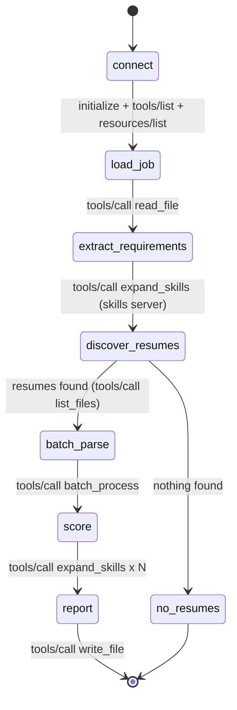
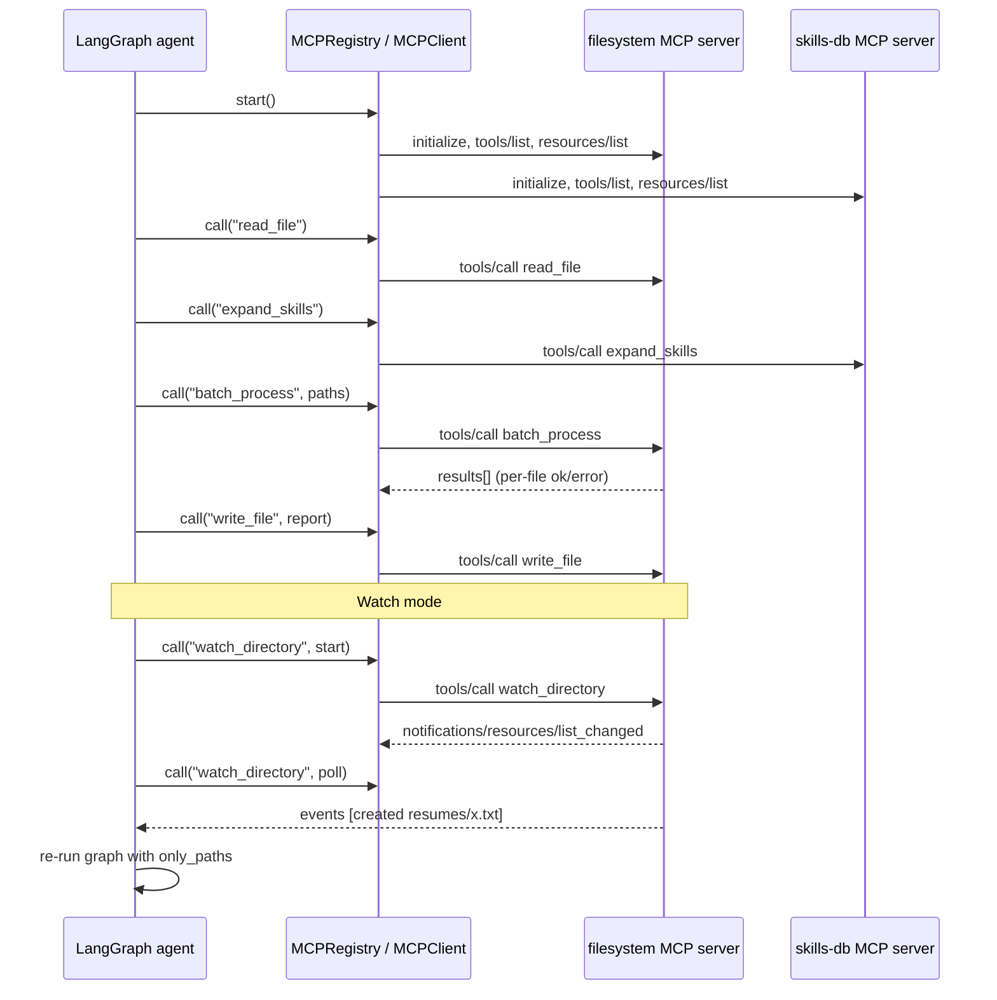

# Workflow diagrams

PNG versions: `workflow_state_machine.png` (LangGraph graph) and `mcp_sequence.png` (message flow).
Regenerate with `python docs/make_diagrams.py`. Mermaid sources below render on GitHub / VS Code.

## 1. LangGraph state machine

## 2. Agent <-> MCP interaction

## 3. Routing

`MCPRegistry` calls `tools/list` on every server at start-up and builds `tool name -> server`.
Graph nodes only say `reg.call("batch_process", ...)`; they never know which server answers.
Adding a third server (web search, database ...) is one entry in `default_servers()`.
